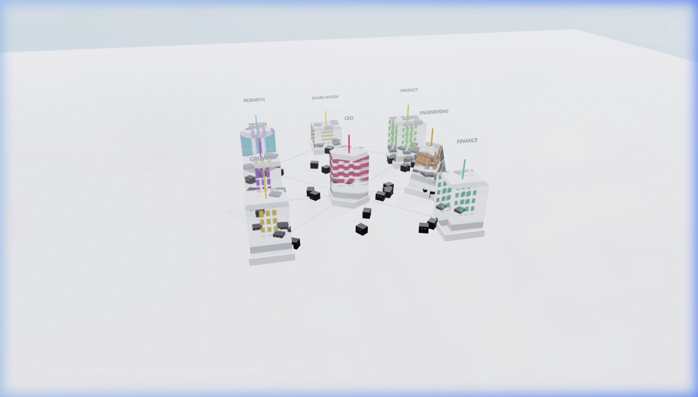

# blackLAB Factory: Autonomous Venture Studio 🚀

**blackLAB Factory** is a premium, AI-driven corporate infrastructure scaffold. It simulates a fully-fledged venture studio with diverse specialized departments, real-time 3D monitoring, and an autonomous executive loop.



## 🏗 The 3D Metaverse Campus (Console)

A high-tech, **Apple-inspired** 3D visualization that provides a "god-view" of your AI company in motion. Located at `http://127.0.0.1:8000/console`.

- **Architectural Diversity**: Specialized building shapes for each department (Cylinders for Design, Pyramids for Growth, Hexagons for Engineering, and Boxes for CEO/Finance) to give the campus a modern, silicon-valley feel.
- **AgentRovers**: Cute autonomous low-poly bots that transport data packets between departments in real-time.
- **Dynamic Illumination**: Internal "server rack" lighting that syncs with real-time AI processing activity, now perfectly nested within the building geometries.
- **Atmospheric Visualization**: Bright, modern daylight aesthetic with smooth transitions, soft fog, and high-performance instanced rendering.

---

## 🏢 Department Infrastructure

The factory maintains a fixed set of high-performance departments that coordinate to fulfill complex missions:

- **CEO**: Orchestration and strategic alignment.
- **Research**: Market analysis and data retrieval.
- **Product**: Technical specification and roadmap planning.
- **Design**: UI/UX logic and visual conceptualization.
- **Engineering**: Implementation and code architectural planning.
- **Growth**: Marketing strategy and user acquisition loop.
- **Finance**: Resource allocation and ROI estimation.
- **Board Review**: Final consolidation and operator briefing.

---

## ⚡️ Quick Start

### 1. Synchronize & Launch
```bash
uv sync --group dev
chmod +x ./blacklab.sh
./blacklab.sh start
```

### 2. Enter the Control Plane
```bash
./blacklab.sh open
```

Open [http://127.0.0.1:8000](http://127.0.0.1:8000) to access the control plane, or jump directly into the **3D Metaverse Campus** at [http://127.0.0.1:8000/console](http://127.0.0.1:8000/console).

### 3. Stop It When You Are Done
```bash
# In the terminal where the server is running
Ctrl+C
```

Optional background mode:
```bash
./blacklab.sh start-bg
./blacklab.sh stop
```

The web app now handles normal operation:

- `/launch`: launch a single company run
- `/autopilot`: start or stop the 24/7 loop
- `/settings`: save default models and autonomy
- `/operator`: control the system through the built-in operator chat
- `/console`: visual-only metaverse view

---

## 🛠 Features

- **Multi-Agent Orchestration**: Massive parallelization of department logic.
- **Tiered Runtime Profiles**: Core planning and implementation can run on a premium model while review and validation stay lightweight.
- **Real-time Inspection**: Watch the "AgentRovers" move as the AI processes each step.
- **Persistence**: Every decision, artifact, and risk is logged under `.factory/runs/`.
- **Codex Integration**: Native support for your local CLI subscriptions (No extra API keys required in `codex` mode).
- **Local-first Runtime**: A single `./blacklab.sh start` command is the recommended way to bring the company online.
- **macOS Native**: Optional `launchd` integration still exists, but it is no longer the default local workflow.

---

## 📂 Project Layout

- `src/blacklab_factory/`: Core factory runtime, engine, and dashboard.
- `frontend/`: React-based 3D Metaverse Campus Source.
- `config/company.yaml`: Department behavior and configuration.
- `docs/`: Comprehensive technical decision records and market mapping.

---

*Designed by juns at blackLAB Factory.*
